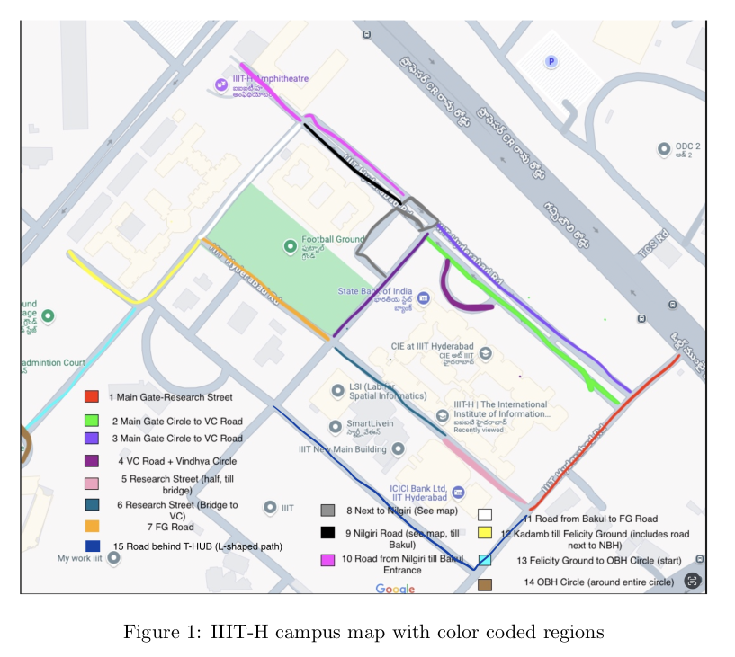
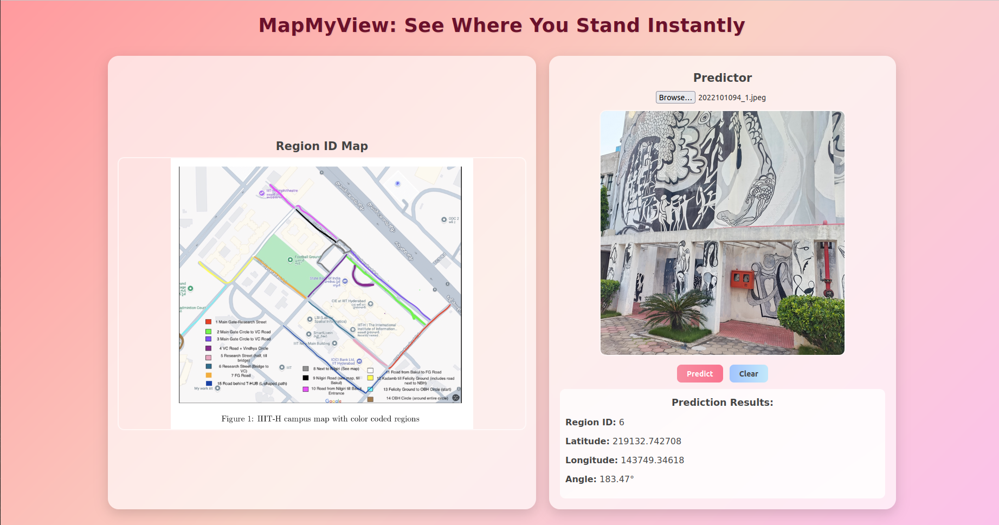

# 🗺️ MapMyView: See Where You Stand Instantly 🌍

[](https://www.python.org/)
[](https://reactjs.org/)
[](https://fastapi.tiangolo.com/)
[](https://pytorch.org/)

## 📋 Table of Contents
- [Project Overview](#-project-overview)
- [Architecture & Models](#-architecture--models)
- [Directory Structure](#-directory-structure)
- [Tech Stack](#-tech-stack)
- [Installation & Setup](#-installation--setup)
- [API Endpoints](#-api-endpoints)
- [Frontend Features](#-frontend-features)
- [Model Performance](#-model-performance)
- [Future Improvements](#-future-improvements)

## 🌟 Project Overview

**MapMyView** is an advanced location recognition system designed to identify campus regions, precise geographic coordinates, and camera orientation from user-submitted images. Using state-of-the-art deep learning models, the system processes images in real-time to return:

- 🏙️ **Region ID**: Identifies specific campus areas from 15 distinct regions
- 📍 **Latitude/Longitude**: Provides precise geographic positioning
- 🧭 **Angle**: Determines the camera orientation angle (0-360°)

This project leverages multiple specialized neural networks for accurate spatial awareness, making it perfect for campus navigation, tour guides, educational applications, and geolocation verification systems.

## 🧠 Architecture & Models

MapMyView employs a sophisticated multi-model architecture, each trained for specific tasks:

### 1️⃣ Region Classification Model

- 🔍 **Architecture**: Fine-tuned ConvNeXt Small with custom classification head
- 🧩 **Features**:
  - Transfer learning with ImageNet pre-trained weights
  - Early layer freezing to prevent overfitting
  - Advanced classifier with LayerNorm, GELU activations, and strategic dropout
  - 15-class output for precise region identification
- 📈 **Performance**: 96.75% validation accuracy

### 2️⃣ Geographic Coordinate Prediction Model


- 🔍 **Architecture**: Swin Transformer (`swin_base_patch4_window7_224`) with dual regression heads
- 🧩 **Features**:
  - Hierarchical feature fusion with dimension reduction (1024→512)
  - Separate specialized prediction pathways for latitude and longitude
  - Coordinate standardization for improved training stability
  - Anomaly filtering for cleaner validation data
- 📈 **Performance**: High-precision geographic coordinates with normalized MSE

### 3️⃣ Angle Prediction Model


- 🔍 **Architecture**: EfficientNet B0 with circular regression approach
- 🧩 **Features**:
  - Predicts sine/cosine components instead of direct angles
  - Unit circle normalization for consistent angle reconstruction
  - Angular-aware data augmentation preserving circular properties
  - Exponential Moving Average for improved stability
- 📈 **Performance**: Mean Absolute Angular Error (MAAE) of 27°

## 📁 Directory Structure

```
MapMyView/
├── 📄 main.py              # FastAPI server implementation
├── 📄 requirements.txt     # Python dependencies
├── 📂 Models/        # Model weights and data files
│   ├── 📄 region_final.pth              # Region classifier weights
│   ├── 📄 latlong_only_images_final_22.pth # Lat/Long model weights
│   ├── 📄 angle_final_only_images_27.pt # Angle predictor weights
│   └── 📄 cleaned_data_train.csv        # Training data statistics
├── 📂 frontend/            # React frontend application
│   ├── 📄 package.json     # NPM dependencies
│   ├── 📂 public/          # Static assets including maps
│   │   └── 📄 regionmap.png     # Campus region map
│   └── 📂 src/             # React source code
│       ├── 📄 App.js       # Main application component
│       └── 📄 App.css      # Application styling
```

## 🛠️ Tech Stack

### Backend Technologies
- 🐍 **Python 3.9+**: Core programming language
- ⚡ **FastAPI**: High-performance API framework
- 🔥 **PyTorch**: Deep learning framework
- 🧮 **Timm**: PyTorch Image Models library
- 🖼️ **Pillow**: Image processing
- 🔢 **Pandas**: Data manipulation

### Frontend Technologies
- ⚛️ **React**: User interface library
- 🌐 **Axios**: HTTP client for API requests
- 🎨 **CSS3**: Custom styling and responsive design

### Deep Learning Components
- 🧠 **ConvNeXt**: Advanced convolutional architecture for region classification
- 🔍 **Swin Transformer**: Vision transformer for coordinate prediction
- 📊 **EfficientNet**: Efficient CNN for angle prediction
- 📐 **Circular Regression**: Specialized approach for angle prediction

## 🚀 Installation & Setup

### Backend Setup

1. Clone the repository:
   ```bash
   git clone https://github.com/yourusername/MapMyView.git
   cd MapMyView
   ```

2. Create and activate a virtual environment:
   ```bash
   python -m venv venv
   source venv/bin/activate  # On Windows: venv\Scripts\activate
   ```

3. Install dependencies:
   ```bash
   pip install -r requirements.txt
   ```

4. Download model weights and place them in the `Models` directory:
   - `region_final.pth`
   - `latlong_only_images_final_22.pth`
   - `angle_final_only_images_27.pt`

5. Run the FastAPI server:
   ```bash
   uvicorn main:app --reload
   ```

### Frontend Setup

1. Navigate to the frontend directory:
   ```bash
   cd frontend
   ```

2. Install dependencies:
   ```bash
   npm install
   ```

3. Start the development server:
   ```bash
   npm start
   ```

4. The application will be available at `http://localhost:3000`

## 🔌 API Endpoints

### `/predict/` (POST)
- **Function**: Process an image and return region, coordinates, and angle predictions
- **Input**: Image file (multipart/form-data)
- **Output**: JSON with the following structure:
  ```json
  {
    "Region_ID": 5,
    "latitude": 17.445923,
    "longitude": 78.348721,
    "angle": 157.24
  }
  ```

## 💻 Frontend Features

- 📤 **Image Upload**: Intuitive file selection interface
- 👁️ **Image Preview**: Visual feedback before prediction
- 🚀 **One-Click Prediction**: Simple prediction initiation
- 🔄 **Clear Function**: Reset the application state
- 🗺️ **Region Map**: Visual reference for region IDs
- 📊 **Result Display**: Clear presentation of prediction outcomes

## 📊 Model Performance

### Region Classification
- **Accuracy**: 96.75% on validation set
- **Training**: Mixed precision with CosineAnnealingWarmRestarts scheduler
- **Regularization**: Strategic dropout and label smoothing (0.15)

### Latitude/Longitude Prediction
- **MSE**: ~22,000 unscaled MSE
- **Training**: OneCycleLR with separate learning rates for backbone and heads
- **Optimization**: AdamW with weight decay (1e-2)

### Angle Prediction
- **MAAE**: 27° mean absolute angular error
- **Training**: Circular regression with composite loss function
- **Techniques**: Exponential Moving Average (decay=0.998)

## 🔮 Future Improvements

- 🌐 **Global Positioning**: Extend beyond campus to wider geographic areas
- 📱 **Mobile Application**: Develop native mobile versions for Android and iOS
- 🔄 **Real-Time Processing**: Implement video stream processing
- 🧠 **Ensemble Methods**: Combine multiple models for even higher accuracy
- 🌦️ **Weather Robustness**: Improve performance under varying weather conditions
- 🎯 **Point-of-Interest Detection**: Add landmark identification
- 🔒 **Edge Deployment**: Move processing to edge devices for privacy

---

## 👨‍💻 Project Contributors

- **Mayank Mittal** - *Primary Developer* - [GitHub](https://github.com/mayankmittal29)


<p align="center">
  Made with ❤️ for IIIT Hyderabad Campus
</p>
